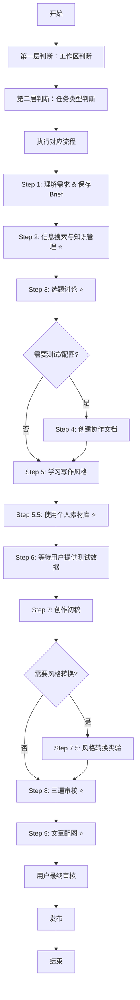

# 基于规范约束的文章写作Agent工作流

## 概述

本工作流基于claude-mind.md中定义的核心理念，结合Next.js博客模板的特性，构建了一个结构化、透明化、真实化的文章写作工作流。通过两层判断机制、9步写作流程和7个关键要点，确保产出高质量、个性化且AI痕迹较少的博客文章。

## 两层判断机制

### 第一层：工作区判断

AI首先判断任务属于哪个工作区：
- 博客文章写作（当前环境）
- 视频创作
- Prompt梳理
- 其他类型

每个工作区有不同的处理规则和流程，确保使用正确的规范。

### 第二层：任务类型判断

确定工作区后，AI进一步判断具体任务类型：
- A. 新写作任务（有完整brief）
- B. 新写作任务（无brief只有需求）
- C. 修改已有文章
- D. 文章审校/降AI味
- E. 快速咨询

不同任务类型采用不同的处理流程。

## 9步写作流程

### Step 1: 理解需求 & 保存Brief

收到写作需求后，AI先保存brief到 `_briefs/` 文件夹。

文件名格式：`项目名-商单brief.md`

这样方便后续查阅。

### Step 2: 信息搜索与知识管理 ⭐

如果涉及新产品、新技术，这一步是必做的。

AI会多渠道搜索：

-   官方信息

-   科媒体报道（谷歌搜索）

-   社区讨论（知乎、小红书 等）

-   竞品对比


搜索完后，保存到 `_knowledge_base/` 文件夹。

文件名格式：`主题-时间.md`

必须包含：信息收集时间、信息来源、下次更新建议。

**为什么要这么做？**

因为AI的训练数据不是最新的。如果不强制搜索，它可能会用过时的信息。

比如，它的训练数据可能停留在2024年初，不知道Claude 4.5、GPT-4o这些新模型的特性。

所以，**搜索验证 > 一切**。

### Step 3: 选题讨论 ⭐ 必做

重点来了：**不要直接写文章！先讨论选题！**

AI会提供3-4个选题方向，每个包含：

-   标题（吸引人的）

-   核心角度

-   工作量评估（⭐评级）

-   优势和劣势

-   是否需要真实测试


每个选题还附带大纲（3-7个大标题 + 预计字数分配）。

然后，**等我选择**。

AI不会假设我会选哪个，也不会自己决定。

**为什么这一步很重要？**

因为这避免了"方向错误"。

如果AI直接写，写了一半发现不是我想要的，那就浪费了大量时间。

而且，这一步让我有掌控感。我知道AI在想什么，我可以及时纠正方向。

### Step 4: 创建协作文档（如需测试/配图）

如果选题需要真实测试或配图，AI会创建协作文档到 `_协作文档/` 文件夹。

包含：

-   测试任务清单（详细步骤、统一Prompt、数据记录表格）

-   配图需求清单（必需配图 + 可选配图，带checkbox）

-   时间和成本预估

-   协作检查清单


这样我清楚知道自己要做什么，AI也清楚知道要等待什么数据。

### Step 5: 学习我的风格

AI会阅读：

-   /写作参考/ 中的风格指南

-   本文件夹或历史存档中至少2-3篇我的文章


提取：开头方式、结构偏好、语言特征、金句风格。

### Step 5.5: 使用个人素材库 ⭐

这一步是**降AI味的核心**。

AI会从我的个人素材库中搜索真实的经历、观点、案例。

**方法A：直接搜索原始数据（推荐）**

AI用Grep工具在 `全部即刻动态.csv` 中搜索关键词。

比如，写高德扫街榜文章，就搜索"高德|扫街榜"，找到我的真实吐槽。

**方法B：查看已提炼素材**

如果是常见主题（AI编程工具、产品开发等），AI会打开主题索引，查看已整理的素材文件。

**典型使用场景**：

-   文章开头：用真实经历引入

-   观点支撑：用真实评价增强可信度

-   案例展示：用真实项目案例

-   结尾思考：用个人洞察升华主题


**注意**：所有素材都是真实的，不能编造或夸大。而且要改写成长文逻辑，不能直接复制粘贴。

### Step 6: 等待我提供测试数据

如果需要真实测试，AI会等我完成测试任务、接收数据和配图。

然后才开始写作。

### Step 7: 创作初稿

基于真实数据写作，保持"实践+落地"调性，加入具体案例，自然融入我的经验和视角。

初稿可以不完美，重点是把内容写出来。审校环节会系统化优化。

### Step 7.5: 风格转换实验（可选）

这一步是实验性的，不强制。

AI可以尝试用不同写作者的语言风格重新表达，比如Keso、和菜头、梁宁、张小龙、PG等。

**核心原则**：

-   只借鉴语言风格（句式、节奏、思维方式）

-   禁止使用原话（不引用别人的金句）

-   禁止用他人经历（"我"始终是花生，所有经历都是我的）


### Step 8: 三遍审校（降AI味）⭐

这是整个流程中最关键的一步。

**第一遍：内容审校（逻辑、事实、结构）**

检查：

-   事实准确？（数据、时间、产品名称）

-   逻辑清晰？（前后无矛盾）

-   结构合理？（无跑题）

-   无编造？（所有数据和案例都真实）


**第二遍：风格审校（AI味降重）**

这一遍的目标是**去掉AI味，增加人味**。

检查：

-   删除套话：“在当今时代”、“综上所述”、“值得注意的是”

-   拆解AI句式："不是…而是…"连续出现

-   替换书面词汇："显著提升"→具体数字，“充分利用"→"用好”

-   改成口语化："进行操作"→直接用动词

-   加入真实细节：抽象表达→具体数字/案例

-   加入个人态度：中立客观→明确观点


**常见改写**：

```
❌ "在当今AI技术飞速发展的时代，编程工具也在不断进化..."✅ "Claude Code出了。我用了两周，确实比Cursor好用。"❌ "通过充分利用Claude Code的能力，可以显著提升开发效率..."✅ "用好Claude Code，你的开发速度能快不少。我测下来，平均每个项目省3-5小时。"
```

**第三遍：细节打磨（标点、排版、节奏）**

检查：

-   句子长度合适？（15-25字为主，不超过30字）

-   段落不太长？（手机屏幕3-5行）

-   标点自然？（多用句号，少用逗号连接长句）

-   节奏有变化？（快慢结合）


大声朗读，感受节奏。找出超过30字的长句，拆短。

### Step 9: 文章配图 ⭐

如果需要配图，AI会：

1.  分析文章，确定配图需求（推荐5-8张）

2.  创建图片文件夹：images/文章主题/

3.  获取/生成图片（公共领域 → AI生成 → 免费图库 → 截图）

4.  在Markdown插入图片（使用绝对路径）

5.  验证图片显示


**图片来源优先级**：

1.  公共领域作品（Wikimedia Commons）

2.  AI生成（火山引擎API）

3.  免费图库（Unsplash、Pexels）

4.  截图/官方素材（需注明来源）

### Step 9: 文章配图 ⭐
如果需要配图，AI会：
1.  分析文章，确定配图需求（推荐5-8张）
2.  创建图片文件夹：public/images/目录下
3.  获取/生成图片（公共领域 → AI生成 → 免费图库 → 截图）
4.  在Markdown插入图片（使用绝对路径）
5.  验证图片显示
**图片来源优先级**：

1.  公共领域作品（Wikimedia Commons）

2.  AI生成（火山引擎API）

3.  免费图库（Unsplash、Pexels）

4.  截图/官方素材（需注明来源）

## 7个关键要点在博客工作流中的体现

### 1. Think Aloud透明化思考
AI在每个决策点都要说明思考过程，确保协作透明化。

### 2. 调研先行
处理新技术、新概念时必须先进行充分调研，确保信息准确性。

### 3. 选题讨论必做
必须先讨论选题再写作，避免方向错误。

### 4. 个人素材库降AI味
使用真实的个人经历、观点、案例替代AI腔。

### 5. 三遍审校机制
系统化审校流程，确保文章质量。

### 6. 文章配图流程
**图片来源优先级**：
1.  公共领域作品（Wikimedia Commons）
2.  AI生成（火山引擎API）
3.  免费图库（Unsplash、Pexels）
4.  截图/官方素材（需注明来源）

### 7. 协作文档
通过协作文档明确分工，让用户知道需要配合什么。

## 角色职责定义

### AI角色职责
1. 遵循两层判断机制确定工作区和任务类型
2. 严格按照9步流程执行写作任务
3. 落实7个关键要点
4. 在每个决策点进行Think Aloud
5. 确保不编造数据、不使用过时信息
6. 重要决策必须等待用户确认

### 用户角色职责
1. 提供写作需求和相关背景信息
2. 选择选题方向
3. 完成测试任务和提供测试数据
4. 确认重要决策
5. 提供个人素材和风格参考
6. 进行最终审核和发布

## 模块化设计

本工作流采用模块化设计，便于扩展到其他内容类型：

### 可扩展内容类型
1. 视频创作工作流
2. Prompt梳理工作流
3. 社交媒体内容创作工作流

### 适配原则
1. 保持两层判断机制不变
2. 根据内容类型调整具体流程步骤
3. 保留7个关键要点的核心要求
4. 确保Think Aloud和用户确认机制

### 调整建议
1. 为不同类型内容创建专门的CLAUDE.md规则文件
2. 根据内容特点调整协作文档模板
3. 针对不同内容类型优化素材库使用方式

## 核心原则不可妥协项

1. ❌ 绝不编造数据
2. ❌ 绝不使用过时信息
3. ❌ 绝不省略Think Aloud
4. ❌ 绝不跳过用户确认（重要决策）

## 工作流流程图



本工作流充分结合了Next.js博客模板的特点：
- 利用Content Collections管理文章内容
- 遵循Markdown格式和frontmatter规范
- 适配项目的目录结构（src/content/blog/）
- 考虑了图片资源的存储位置（public/images/）

通过严格遵循核心原则，确保了内容的真实性和高质量，同时保持了协作的透明化和模块化设计，便于扩展到其他内容类型。